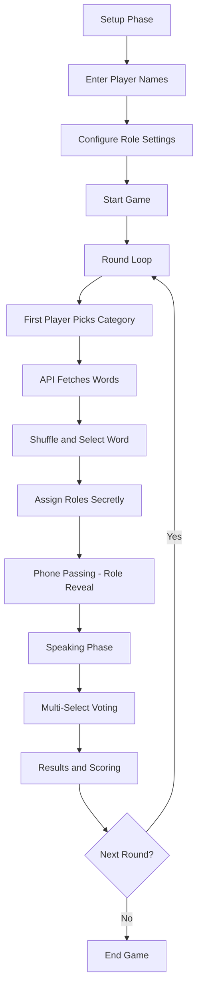
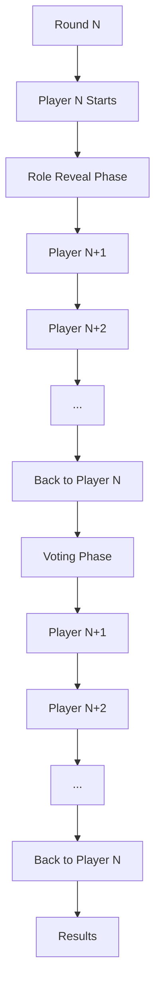
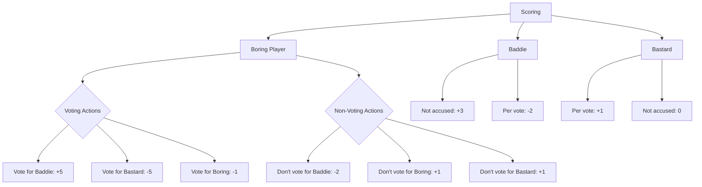

# Boring, Baddie and Bastards - Social Deduction Game

A browser-based social deduction party game for groups, played on a single phone passed between players. Inspired by games like Imposter and Chameleon, this game features unique roles and strategic voting mechanics.

## 🎯 Game Overview

Boring, Baddie and Bastards is a social deduction game where players take on different roles with conflicting objectives:

- **Boring**: Sees the word, tries to identify the Baddie and Bastard
- **Baddie**: Doesn't see the word, tries to blend in as Boring
- **Bastard**: Sees the word, tries to be accused as Baddie

The game is played on a single device passed around the group, with rounds rotating through players.

## 🚀 Getting Started

1. Clone this repository
2. Open `index.html` in a web browser
3. Add player names and configure role settings
4. Start playing!

The game works on any modern browser and is optimized for mobile devices.

## 🎮 Game Flow



## 🔁 Round Structure



## 📊 Scoring System

### Boring Players

| Action | Points |
|--------|--------|
| Vote for Boring | -1 |
| Vote for Baddie | +5 |
| Vote for Bastard | -5 |
| Don't vote for Boring | +1 |
| Don't vote for Baddie | -2 |
| Don't vote for Bastard | +1 |

### Other Roles

- **Baddie**: +3 points if not accused, -2 points per vote received
- **Bastard**: +1 point per vote received, 0 if not accused



## ⚙️ Technical Implementation

### API Integration

The game uses a production API endpoint to fetch words based on categories:

```javascript
const API_URL = "https://endpointsf7aelfcb-option-generator.functions.fnc.fr-par.scw.cloud?term=";
```

The API returns a JSON array of words, which is then shuffled to ensure variety across rounds.

### Key Features

- **Player Management**: Add/remove players with real-time updates
- **Role Configuration**: Flexible min/max settings for Baddies and Bastards
- **Phone Passing**: Complete player cycle every round, regardless of starting player
- **Multi-Select Voting**: Players can vote for multiple suspects
- **Role Secrecy**: Role counts hidden during assignment, revealed only at results
- **Error Handling**: Clear error messages without fallback words

## 🤝 Contributing

Contributions are welcome! Please feel free to submit issues or pull requests.

## 📄 License

This program is free software: you can redistribute it and/or modify it under the terms of the GNU Affero General Public License as published by the Free Software Foundation, version 3 of the License.
This program is distributed in the hope that it will be useful, but WITHOUT ANY WARRANTY; without even the implied warranty of MERCHANTABILITY or FITNESS FOR A PARTICULAR PURPOSE. See the GNU Affero General Public License for more details.
You should have received a copy of the GNU Affero General Public License along with this program. If not, see https://www.gnu.org/licenses/.

## 📚 References

- [Social Deduction Game Design](https://en.wikipedia.org/wiki/Social_deduction_game)
- [Pass-and-Play Game Mechanics](https://gamedeveloper.com/design/pass-and-play-games)
- [Browser Game Development](https://developer.mozilla.org/en-US/docs/Web/Guide/HTML/Games)
